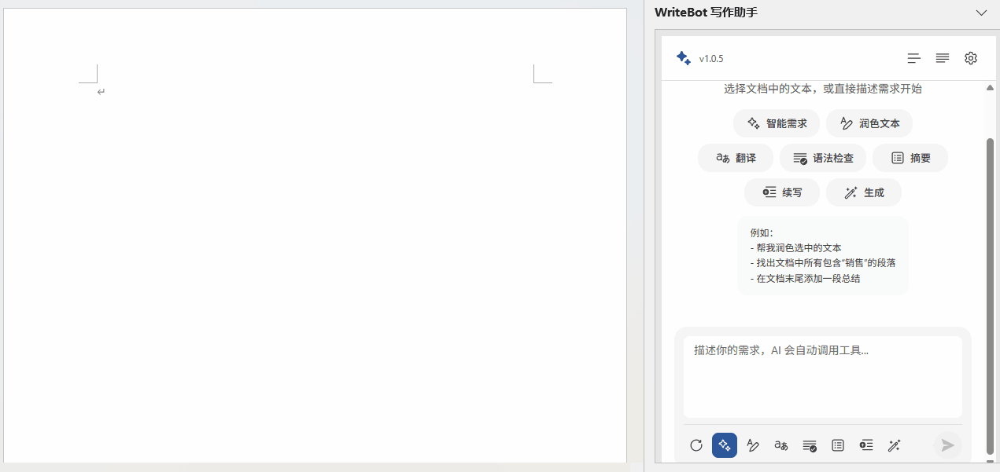
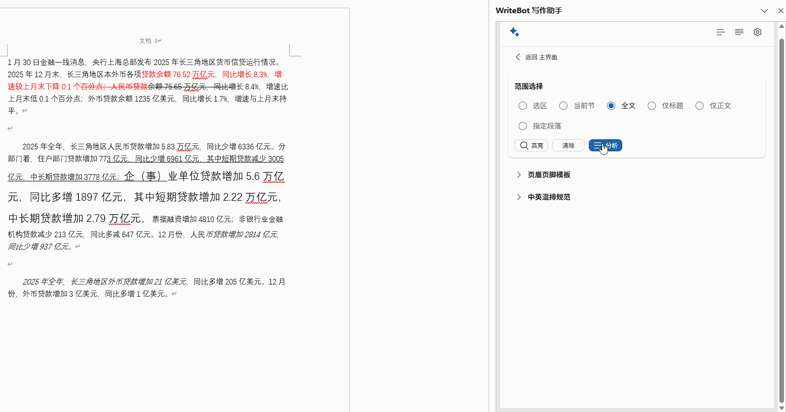

# WriteBot - Word 智能写作助手

<p align="center">
  <strong>让 AI 帮你写文档、改格式、查语法，就在 Word 里面用</strong>
</p>

<p align="center">
  
  
  
  
</p>

---

## WriteBot 是什么？

WriteBot 是一个安装在 Microsoft Word 里的 **AI 写作助手**。安装后，你可以在 Word 中直接和 AI 对话，让它帮你：

- 润色文章、修改语法错误
- 翻译中英文
- 自动生成摘要、续写内容
- 一键整理文档格式（字体、间距、页眉页脚等）
- 统计字数、句子数、段落数

**无需切换到其他软件**，所有操作都在 Word 内完成。

---

## 功能一览

### AI 写作助手

在 Word 侧边栏中与 AI 对话，AI 可以直接读取和修改你的文档。

| 你想做的事 | WriteBot 怎么帮你 |
|------------|-------------------|
| 让文章更通顺 | **文本润色** — AI 优化你的表达，让内容更流畅自然 |
| 检查语法错误 | **语法检查** — 自动找出并修正语法问题 |
| 翻译文档 | **翻译** — 支持中文和英文互相翻译 |
| 快速了解长文内容 | **生成摘要** — 自动提取核心内容，生成精炼摘要 |
| 写不下去了 | **续写内容** — AI 帮你接着写，可选正式/轻松/专业/创意风格 |
| 从零开始写 | **生成内容** — 告诉 AI 你想写什么，它帮你生成初稿 |
| 复杂的修改需求 | **智能需求** — 用自然语言描述你的需求，AI 自动理解并完成 |



### 文本分析

打开文本分析面板，即可实时查看文档的统计信息：

- **字符数** — 总字符数和不含空格的字符数
- **词数** — 支持中英文混合统计
- **句子数** — 文档中的句子总数
- **段落数** — 文档中的段落总数

> 选中部分文字时，会自动统计选中内容；不选中则统计整篇文档。

### 排版助手

文档格式乱了？排版助手帮你一键整理。

| 你想做的事 | WriteBot 怎么帮你 |
|------------|-------------------|
| 检查格式问题 | **格式分析** — 自动扫描文档，列出所有格式问题和优化建议 |
| 批量修改格式 | **变更清单** — 把建议的修改列成清单，你可以逐条确认或一键应用 |
| 统一文字颜色 | **颜色标识治理** — 找出文档中五花八门的颜色，帮你统一规范 |
| 清理多余格式 | **格式标记分析** — 检查下划线、斜体、删除线等是否合理 |
| 设置页眉页脚 | **页眉页脚模板** — 快速配置，支持首页不同、奇偶页不同 |
| 中英文混排不好看 | **中英混排规范** — 自动统一中英文字体、修正间距和标点 |



### 支持多家 AI 服务

WriteBot 支持接入以下 AI 服务（需要你自己提供 API 密钥）：

| AI 服务 | 说明 |
|---------|------|
| **OpenAI** | 支持 GPT 系列模型，可自定义接口地址 |
| **Anthropic** | 支持 Claude 系列模型 |
| **Gemini** | 支持 Google Gemini 系列模型 |

> **关于数据安全**：你的 API 密钥只保存在你自己的电脑上（加密存储），不会上传到任何服务器。WriteBot 只在你使用 AI 功能时，才会将文档内容发送给你选择的 AI 服务。

---

## 安装教程

### 第一步：运行安装程序

1. 找到 `WriteBotSetup.exe` 安装文件
2. 直接双击运行 或 **右键点击** → 选择 **"以管理员身份运行"**
3. 按照提示完成安装（建议保持默认安装路径）

#### 默认安装到 `C:\Users\<用户名>\WriteBot`

#### 如需自定义路径：运行 `WriteBotSetup.exe --target "D:\WriteBot"`

> 安装程序会自动完成所有配置，包括安装必要的安全证书和后台服务。

### 第二步：配置 Word（仅首次需要）

安装完成后，需要在 Word 中添加一个信任目录，这样 Word 才能加载 WriteBot：

1. 打开 Word
2. 点击左上角 **文件** → **选项** → **信任中心** → **信任中心设置**
3. 在左侧选择 **受信任的加载项目录**
4. 按下图所示添加目录：


完整的配置界面如下：


### 第三步：开始使用

1. 打开（或重新打开）Word
2. 点击顶部菜单栏的 **加载项** → 选择 **WriteBot**
3. 侧边栏会出现 WriteBot 面板，在设置中填入你的 AI 服务 API 密钥即可开始使用

> WriteBot 的后台服务会在 Word 启动时自动运行，Word 关闭后自动停止，无需手动管理。

### 更新方法

直接运行最新版的 `WriteBotSetup.exe` 即可完成更新，无需卸载旧版本。

---

## 常见问题

<details>
<summary><strong>WriteBot 面板打不开 / 加载失败怎么办？</strong></summary>

**可能原因**：后台服务未启动。

**解决方法**：

1. 按键盘上的 `Win + X`，选择 **"终端(管理员)"** 或 **"PowerShell(管理员)"**
2. 输入以下命令检查服务状态：
   ```
   Get-Service -Name "WriteBot"
   ```
3. 如果状态不是 "Running"，输入以下命令启动服务：
   ```
   Start-Service -Name "WriteBot"
   ```
4. 重新打开 Word 试试

如果问题仍然存在，可以查看安装目录下 `logs` 文件夹中的日志文件。

</details>

<details>
<summary><strong>面板显示异常或显示旧版本怎么办？</strong></summary>

**可能原因**：Office 缓存了旧的加载项数据。

**解决方法**：

1. **完全关闭**所有 Office 程序（Word、Excel、Outlook 等都要关掉）
2. 按 `Win + R` 打开运行窗口，输入以下路径并回车：
   ```
   %LOCALAPPDATA%\Microsoft\Office\16.0\Wef
   ```
3. 删除打开的文件夹中的**所有内容**
4. 重新打开 Word

</details>

<details>
<summary><strong>提示证书不受信任怎么办？</strong></summary>

**解决方法**：以管理员身份重新运行一次 `WriteBotSetup.exe`，安装程序会自动重新安装证书。

</details>

<details>
<summary><strong>服务启动失败怎么办？</strong></summary>

**可能原因**：WriteBot 使用的网络端口（53000）被其他程序占用了。

**解决方法**：

1. 按 `Win + X`，选择 **"终端(管理员)"**
2. 输入以下命令查看端口占用情况：
   ```
   netstat -ano | findstr "53000"
   ```
3. 如果有其他程序占用了该端口，关闭该程序后重试

</details>

---

## 开发者指南

> 以下内容面向开发者，普通用户无需阅读。

### 环境要求

- Node.js 18+
- Bun（推荐）或 npm

### 安装 Bun（Windows）

```powershell
irm https://bun.sh/install.ps1 | iex
```

安装后确认版本：

```powershell
bun --version
```

### 本地开发

```bash
# 安装依赖
bun install

# 启动开发服务器
bun run dev-server

# 类型检查
bun run typecheck

# 代码检查
bun run lint
```

### 构建安装包

```bash
bun install
bun run build:setup
```

生成文件：`release\WriteBotSetup.exe`

### 技术栈

| 技术 | 用途 |
|------|------|
| React 19 | UI 框架 |
| TypeScript | 类型安全 |
| Fluent UI | 微软设计系统组件库 |
| Office.js | Office 加载项 API |
| Webpack | 构建工具 |
| Bun | 包管理与构建 |

---

## 许可证

MIT License
